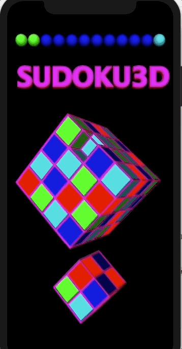

# SUDOKU3D
What do you get when you cross a rubiks cube with a sudoku?
A level is won when every color is represented in every column, row, and depth. 
Center cubes are duplicated so that they can be clicked. A darker shade lets you tell between the given cubes and the ones you have guessed.
Good luck!

